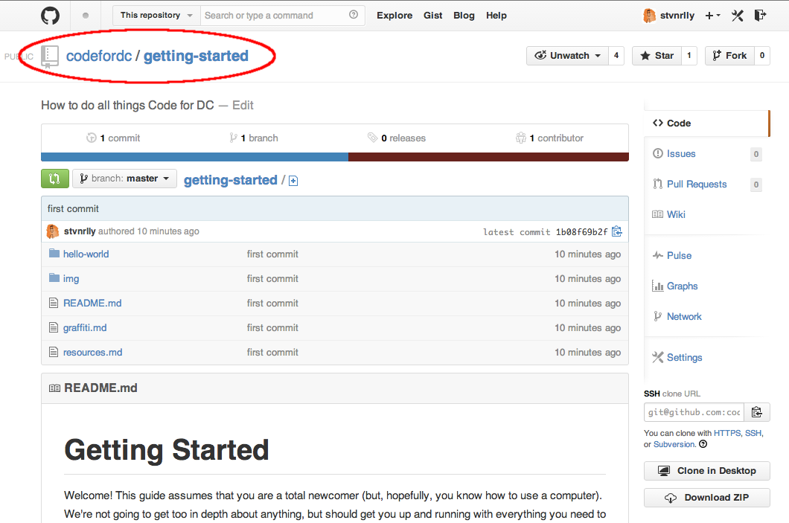

# Getting Started

Welcome! This guide assumes that you are a total newcomer (but, hopefully, you know how to use a computer). We're not going to get too in depth about anything, but should get you up and running with everything you need to begin working. Once you're set up, you can then [dive deeper](learning-resources.md) into any of the individual areas. If you are already familiar with an aspect, feel free to skip it.

This is the plan:

1.    The Command Line
2.    Working with git and Github
3.    Editing!
4.    Making a Pull Request

We're going to use those skills to edit this very repo! At the end, you'll have your own personal copy of this repo, which you can mess around with. Then, using pull requests, you'll propose a change to this repo from changes you made to your personal copy. That might sound fancy now, but we're going to walk through it and make it easy.

If something goes wrong along the way, use Google. Pasting in the error code should get you an explanation of what went wrong and how to fix it.

Okay, let's begin.

## The Command Line

On a Mac, open up your Terminal program. It should look something like this:

### Traversing the CLI

This is your home directory (hence the little :house: up on top). In command line terms, your home directory is notated as `~`. We're going to use this interface to navigate your file structure and run some commands. Here are the tools we'll use to do that:

`ls [directory]`: displays the contents of the directory specified (if none specified, the current directory)

`cd [directory]`: changes to the directory specified (if none specified, the home directory)

`mkdir [directory]`: creates a new directory

`touch [file]`: creates a file

`pwd`: shows you your location in the file system

We're going to need to tell these commands where to do things. Here's how we do that:

The current directory is notated as `.`. The directory above that is notated as `..`. For example, the structure of this repo is:

    .
    ├── README.md
    ├── graffiti.md
    ├── learning
    │   ├── getting-started-osx.md
    │   ├── hello-world
    │   │   ├── hello-world.py
    │   │   └── hello-world.rb
    │   ├── img
    │   │   ├── github-forked-clone.png
    │   │   ├── github-forked-owner.png
    │   │   ├── github-pullrequest-approval.png
    │   │   ├── github-pullrequest-message.png
    │   │   ├── github-pullrequest-start.png
    │   │   ├── github-repo-fork.png
    │   │   ├── github-repo-issues.png
    │   │   ├── github-repo-owner.png
    │   │   └── terminal-start.png
    │   └── learning-resources.md
    ├── what-is
    │   ├── api.md
    │   ├── civic-hacking.md
    │   ├── open-data.md
    │   ├── python.md
    │   └── ruby.md
    └── working
        └── tools.md

So, if I'm in the root of the directory and want to move to the `img` folder, I type `cd img` or `cd ./img` into the terminal. I can then run `ls` to see that `terminal-start.png` is in the current directory.

In all cases, the `tab` key is your friend. It will autocomplete commands and paths and, if there are multiple options, it will show you those options.

### Creating a Folder for Programming Stuff

It's useful to put all of your programming projects in one directory (and it makes for a convenient exercise for our purposes), so let's start with that.

First, let's take a look around the home directory, using `ls`.

    $ ls

You should see something like this:

    Applications    Desktop    Documents    Library    Movies    Music    Pictures    Public

Those are all of the directories you know and love from the file explorer. To peek within any of them, simply enter `ls` followed by the directory name. Give it a shot! Note that no matter how much you `ls`, you return to the same directory for the next command; only `cd` can move you around.

Now, you'll need to decide where in your file structure you'd like to put it. This is a personal choice! Where it is doesn't matter so much as you being able to easily locate it. I keep mine in a Dropbox-type folder, so that my files sync across my devices. Other people might want to put it in their `Documents` folder, or to just put it in the home directory. Choose whatever works for you.

Once you've decided where to put the folder, we'll need to create it. Use `mkdir` to do this, which will look something like this:

    $ mkdir Documents/Programming

Remember that the path will vary based on where you're putting the folder. If you already tried some of those commands and are no longer in the home directory, you can use the full path instead, like this:

    $ mkdir ~/Documents/Programming

### Making files

Now that you have this cool new folder, let's go check it out! If you're not sure where you are, remember that you can use `pwd` to tell you your location. If you're not in the home directory, you can change to it with `cd` or `cd ~`. Using `cd`, change to your programming folder. In our example, this would go like this:

    $ cd Documents/Programming

Remember that you can always go to the directory above the current one by running `cd ..`. This directory is empty, so running `ls` here won't return anything. Let's change that by creating a new file.

    $ touch hello-world.txt

That's it, you made a file! Now, let's write in that file. There are two ways to go about this. First, you can open it in your default text editor:

    $ open hello-word.txt

Second, you can use `echo` to add to it without even leaving the CLI. `echo` is a command that does just that: echoes your input. Thus:

    $ echo 'hello world'
    hello world

By using `>`, we can redirect that output to the file. Thus:

    $ echo 'hello world' > hello-world.txt

Check the file and you'll see that it's true.

There are a few other commands that you may want to learn, like `rm`, `cp`, `mv`, and `cat`, but you are now more than prepared for the next step.

## Working with git and Github

In this step, you're going to set up a new command line program called git, get running on Github, and create a local version of this repo to work on.

Git is a piece of version control software. It allows you to work on the same repository (a group of files, basically) as another person, at the exact same time, without totally messing each other up. It does this by grouping changes into `commits`, which you then `push` to the central repo. You can only `push` if your local versions has all the previous commits. So, if somebody else pushed commits since you last checked, you must `pull` and `merge` those changes into your local copy before you can `push` your new changes.

That might sound confusing, but it should become clearer as we walk through the process. So, here we go.

### Installing git

Git is a program on your computer, so it needs to be installed. It's not too hard: just go [here](http://git-scm.com/downloads), download the latest version, and install it like any other program. If you'd like to get fancy, you can install it using a package manager like [Homebrew](http://brew.sh/), which makes installation as easy as running `brew install git` on your command line. It's not strictly necessary here, but it might make your life easier down the line.

Once you've installed git, you should check that everything worked properly. In Terminal, run the command `git`; hopefully, you'll get a brief view of all the options for the command.

### Using Github

As mentioned above, git works by holding a central repo of all of the files, to which people push their changes. That repo has to live somewhere that is accessible to all of those people, and Github is often the service of choice. As you can tell, we're also using Github. So, if you have a Github account, make sure you're logged in. If you don't , go ahead and [sign up](https://github.com/join) and walk through the configuration steps. Then, in order to communicate with Github's servers, you should make sure that you have [SSH keys set up](https://help.github.com/articles/generating-ssh-keys) (this is the hardest step yet, but you can handle it).

Once you're set up with Github, look around this page (mostly near the top) and you'll notice a few things.

First, the name of the repo and its owner. This is listed on the page, as well as in the URL. Right below that, in the gray bar, you can check out the commit history of the repo, which can show you which change happened when. For example, [in this repo](https://github.com/codefordc/getting-started/commits/master), you can see that the [first commit](https://github.com/codefordc/getting-started/commit/1b08f69b2fd5837af42dc12326bd9394414dfbe5) included a few files, the [second commit](https://github.com/codefordc/getting-started/commit/4fb3ad2022931b5a057f4ffe0061c832454ce4d1) was a commit from a pull request, the [third commit](https://github.com/codefordc/getting-started/commit/044f148863601491e1dce26f1f14dc25e4d513b0) merged that commit from a fork of the repo into the Code for DC repo (it might look confusing because @stvnrlly made both commits), and the [fourth commit](https://github.com/codefordc/getting-started/commit/defc8390dce25e61236f350311e124d0bea80d48) added screenshots and more text to this document.

Second, to the right of the code, the `Issues` and `Pull Requests` tabs. Issues are for discussing ideas and problems with the repo. Check out the [issues for this repo](https://github.com/codefordc/getting-started/issues) to see what we're discussing; maybe you can help resolve one of them! Pull requests are how you ask to have your commits added to the repo, which we'll cover once you've pushed some commits to your own version of the repo.

Third, the `Fork` button up in the top right. If you don't have push permissions for the repo (unless it's your repo or the owner has granted you push access, you probably don't), the way to collaborate on a repo is to fork it. This copies the repo and creates your own separate version that you control. You can push commits to it as much as you want without affecting the repo from which you forked it.

So, how do you add your code to the main repo? By making a pull request. This tells the repo's owner that you'd like them to merge some of your commits from your fork into the main repo. Before you do that, though, you'll need to make some commits, and that means doing some coding.

To work on the code, you'll need to get a local copy of the repo. Get started by clicking that `Fork` button, which will take you to your own special version of the repo. As you can see, this repo has the full commit history of the repo you just forked, but it will not include future changes without a pull request. If you go look at [@stvnrlly's fork](https://github.com/stvnrlly/getting-started), for instance, you'll see that it doesn't have any of the more recent commits to the Code for DC repo, but it does have some commits unique to the fork.

Then, check down in the lower right side of the navbar. You'll see an HTTPS or SSH `clone URL`.

Copy this and head back to the Terminal. There, all you have to do is this:

    $ git clone [that clone URL you just copied]

A bunch of stuff will happen, and at the end of it you'll have a brand new local copy of your forked repo, ready to be hacked on.

If you haven't done anything extra, your `Programming` folder should now look something like this:

    .
    ├── hello-world.txt
    └── getting-started

We're going to work on the files in the `getting-started` directory, so go ahead and `cd` into it.

## Editing!

In order to code, you'll probably want a text editor that understands code. Some options include [TextMate](http://macromates.com/), [Sublime](http://www.sublimetext.com/), or [Atom](https://atom.io/); there are [lots](https://en.wikipedia.org/wiki/Comparison_of_text_editors#Programming_features) to choose from.

For our purposes, that's pretty much all you'll need. While we're here, though, we might as well check that you have some of the major programming languages installed on your machine. To do this, we're going to run a couple of ["Hello World"](https://en.wikipedia.org/wiki/Hello_world_program) programs, which we've already put in the repo. It should go something like this:

    $ python hello-world/hello-world.py
    Hello World! (in Python)
    $ ruby hello-world/hello-world.rb
    Hello World! (in Ruby)

You can open those files up in your new text editor to see how that happened.

Now, let's make some edits. Pick a file that you'd like to edit (or make a new file) and open it in the editor. Feel free to edit anything in the repo; if nothing strikes you, we've included the `graffiti.md` file as a free-for-all text file.

Once you've made the edits and saved your work, it's time to do some git magic. Start by checking the status of the repo:

    $ git status

You should get an overview of what files within the repo have been changed. If you edited an existing file, you'll be told that there are `Changes not staged for commit`. If you created a new file, you'll be told that there are `Untracked files`. The message also lets you know that you should `add` them to the staging area in order to commit them. That's a good idea, so let's do it:

    $ git add [the file(s) you want to commit]

You can run `git add` as many times as you'd like before committing the bundle of changes, as well as removing files from the staging area with `git rm [file]`. After adding, run `git status` again, and you should see that the file(s) are now ready to be committed. Great, let's do that:

    $ git commit -m "message explaining what's in the commit"

Git requires that you include a message explaining the changes in the commit; usually, a sentence or less should do the trick.

You can commit as many times as you'd like before pushing those commits to the repo. A good practice is to group similar changes into separate commits, as that will help make the changes clear to others working on the repo (or your future self).

Ready to push? It's easy:

    $ git push origin master

In that command, `origin` refers to the version of the repo on Github, and `master` refers to the branch of the repo. Branches are a whole deeper and awesome layer of git, but you don't know about it just quite yet.

Excellent! You have now edited your repo. Now it's time to request that your changes be pulled back into the original Code for DC version of the repo.

## Making a Pull Request

Back on Github, open up your repo. Remember that `Pull Requests` tab over on the right? Well, now we're going to use it. On that page, just click the `New pull request` button up on the right. You'll end up here:

Github will automatically compare your repo against the Code for DC repo. If everything outside of your committed changes is the same in both repos (this might not be the case if somebody pushed a commit to the file you're working on since you began working), Github will tell you that the pull request can be automatically merged, which will help the owner of the other repo. You can (should) also enter a message explaining what the commits in your pull request will do. Once you're satisfied, hit `Create Pull Request`.

That's it! On the other side, your pull request will look like this:

The owner might accept your request and merge the commits, discuss it and perhaps ask for some changes to the commits, or decline to accept it. In this case, we probably won't accept your first pull request. This is so that you can practice editing and re-submitting a request, and has nothing to do with how good the commits are.

Now you're ready to take on a new challenge, either by finding a [Code for DC project](codefordc.org/projects) to work on, or by creating a new project to add to that list. Happy hacking!
